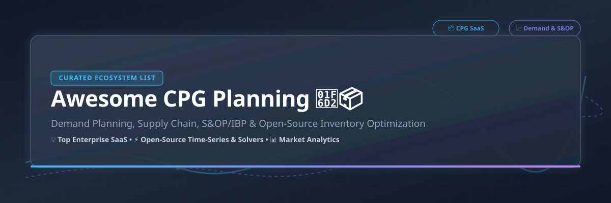

# Awesome Consumer Packaged Goods (CPG) Planning Ecosystem 🛒📦

  
  
  
  
  

## 💡 Overview & Market Insights

Welcome to the definitive curated resource for **Consumer Packaged Goods (CPG) Planning Platforms**, **Supply Chain Management (SCM)**, and **Demand Forecasting Software**. This list tracks enterprise SaaS solutions, cloud platforms, and leading open-source packages for inventory optimization, S&OP (Sales & Operations Planning), IBP (Integrated Business Planning), and retail replenishment.

> 📊 **Sector Market Size & Dynamics**: The global Supply Chain Planning (SCP) & CPG Software market is estimated between **$36 Billion and $62 Billion**, with dedicated supply chain planning software expanding toward **$100+ Billion by 2030**. The sector is **moderately fragmented**: while tier-1 enterprise leaders (Anaplan, Blue Yonder, Kinaxis, o9 Solutions) command multi-billion dollar valuations for end-to-end consensus planning, over **61% of CPG companies** still operate on fragmented legacy tools and custom models, driving high adoption of specialized best-of-breed SaaS tools and open-source forecasting engines.

---

## 📑 Table of Contents

- [☁️ SaaS & Hosted Enterprise Platforms](#-saas--hosted-enterprise-platforms)
- [⚡ Open-Source GitHub Projects](#-open-source-github-projects)
- [🛠️ How to Contribute](#️-how-to-contribute)
- [❤️ Support & Sponsoring](#️-support--sponsoring)
- [📈 Star History](#-star-history)
- [⚠️ Disclaimer](#️-disclaimer)

---

## ☁️ SaaS & Hosted Enterprise Platforms

The table below summarizes leading commercial CPG demand and supply planning platforms. Companies are sorted by **Company Size (Revenue / Valuation)** in descending order.

| Platform / Vendor | Description | Enterprise Scale (Revenue / Valuation) | Starting Pricing Tier | Free Tier / Trial Limit |
| :--- | :--- | :--- | :--- | :--- |
| **[Anaplan](https://www.anaplan.com/)** | Connected enterprise planning platform widely used for demand, supply, and S&OP/IBP processes in CPG and retail. | ~$11 Billion Valuation (~$592M Annual Revenue) | ~$30,000 / year (Entry-level enterprise workspace tier) | No free tier; 90-day restricted sandbox trial for certified Talent Builder program |
| **[Blue Yonder](https://blueyonder.com/)** | Cloud supply chain planning suite covering demand, supply, inventory, and retail/CPG operations with AI decisioning. | $8.5 Billion Valuation (~$1.42 Billion Annual Revenue) | ~$100,000 / year (Custom enterprise contract based on SKUs & nodes) | No free tier; Custom interactive demo upon sales consultation |
| **[RELEX Solutions](https://www.relexsolutions.com/)** | Unified retail and CPG planning platform strong on demand forecasting, replenishment, and store-level space optimization. | ~$5.7 Billion Valuation (~€400M–€500M Annual Revenue) | ~$50,000 / year (Tiered based on DC-store combinations & SKU volume) | No free tier; Custom retail demo on request |
| **[o9 Solutions](https://o9solutions.com/)** | AI-driven digital brain platform for enterprise demand, supply, and integrated business planning across CPG networks. | $3.7 Billion Valuation (~$250M ARR) | ~$75,000 / year (Scales by enterprise network nodes & modules) | No free tier; Private sales-guided enterprise proof-of-concept (PoC) |
| **[Kinaxis](https://www.kinaxis.com/)** | Concurrent planning platform (RapidResponse) for end-to-end supply chain planning, what-if scenarios, and S&OP. | $3.4 Billion Valuation ($603M TTM Revenue) | ~$80,000 / year (Enterprise subscription based on user roles & sites) | No free tier; Guided interactive sandbox demo via sales |
| **[Logility](https://www.logility.com/)** | Supply chain planning platform covering demand, inventory, and replenishment for manufacturers and CPG distribution. | ~$1.2 Billion Valuation (~$100M+ Annual Revenue) | ~$40,000 / year (Module-based subscription licensing) | No free tier; 30-day corporate pilot demo upon request |
| **[Board](https://www.board.com/)** | Business planning and performance management platform combining supply chain, financial, and demand planning. | ~$800 Million Valuation (~$110M Annual Revenue) | ~$25,000 / year (Tiered per user seat & database capacity) | No free tier; 14-day evaluation demo workspace for qualified prospects |
| **[OMP Plus](https://omp.com/)** | Advanced planning and scheduling (APS) / supply chain planning solutions engineered for process and CPG industries. | ~$500 Million Valuation (~$90M Annual Revenue) | ~$50,000 / year (Custom plant/node configuration pricing) | No free tier; Guided simulation demo with industry specialists |
| **[Infor Demand Management](https://www.infor.com/)** | Demand planning and forecasting suite within Infor’s CloudSuite supply chain and ERP ecosystem for CPG. | Strategic ERP Subsidiary (~$3.2B Total Infor Revenue) | ~$35,000 / year (Modular add-on tier to Infor CloudSuite) | No free tier; Product demonstration via enterprise sales team |
| **[ToolsGroup](https://www.toolsgroup.com/)** | Demand forecasting and inventory optimization software focused on service-level-driven planning for CPG distribution. | ~$300 Million Valuation (~$62.1M Annual Revenue) | ~$20,000 / year (Pay-as-you-grow tier for mid-market CPG) | No free tier; Service-level ROI assessment & demo |

---

## ⚡ Open-Source GitHub Projects

Open-source tools provide foundational forecasting models, mathematical optimization solvers, and data orchestration pipelines for building custom CPG supply chain algorithms.

Repositories below are sorted by **GitHub Star Count** (descending).

- **[scikit-learn](https://github.com/scikit-learn/scikit-learn)**   
  📦 Core machine learning framework in Python used for building custom regression, feature engineering, and demand forecasting pipelines.

- **[apache/airflow](https://github.com/apache/airflow)**   
  🔄 Programmatic workflow orchestration engine used to schedule automated demand data extraction, forecast generation, and inventory replenishment runs.

- **[facebook/prophet](https://github.com/facebook/prophet)**   
  📈 Automatic time-series forecasting library designed for business data with daily seasonality, holiday impacts, and structural trend changes.

- **[google/or-tools](https://github.com/google/or-tools)**   
  🧠 Fast combinatorial optimization suite used for linear programming (LP), vehicle routing, safety stock allocation, and constrained supply planning.

- **[dbt-labs/dbt-core](https://github.com/dbt-labs/dbt-core)**   
  🛠️ Data transformation tool to prepare clean, version-controlled demand history datasets, POS (Point of Sale) aggregations, and inventory metrics in SQL.

- **[statsmodels/statsmodels](https://github.com/statsmodels/statsmodels)**   
  📊 Econometric and statistical modeling package in Python providing ARIMA, Holt-Winters exponential smoothing, and hypothesis testing for time-series.

- **[sktime/sktime](https://github.com/sktime/sktime)**   
  ⌛ Unified Python framework for time series machine learning, forecasting, panel data reduction, and demand classification.

- **[pycaret/pycaret](https://github.com/pycaret/pycaret)**   
  🚀 Low-code machine learning library in Python to rapidly compare, train, and deploy demand forecasting and regression models.

- **[unit8co/darts](https://github.com/unit8co/darts)**   
  🎯 Python library for easy manipulation and forecasting of time series, supporting classical models (ARIMA) to deep learning models (N-BEATS, Transformers).

- **[Nixtla/neuralforecast](https://github.com/Nixtla/neuralforecast)**   
  🧠 Scalable neural forecasting algorithms (NHITS, TFT, PatchTST) designed for large-scale hierarchical SKU demand forecasting.

---

## 🛠️ How to Contribute

1. 🍴 Fork the repository.
2. 📝 Add or edit entries in `README.md` (maintain tabular structure for SaaS, or star badges for Open Source).
3. 🔗 Include verified product links, concise descriptions, and accurate metrics.
4. 🚀 Open a Pull Request (PR) with a description of your updates.

---

## ❤️ Support & Sponsoring

If you find this repository valuable for your CPG planning, supply chain analytics, or demand forecasting research, please consider supporting the project!

- ⭐ **Star this repository** to help others discover it.
- 🔀 **Fork and share** with your supply chain engineering team.
- ☕ **Buy me a coffee / Sponsor**: If you'd like to support ongoing maintenance of this awesome ecosystem list, visit the [GitHub Sponsor Dashboard](https://github.com/sponsors/ishandutta2007). Thank you for your support!

---

## 📈 Star History

---

## ⚠️ Disclaimer

- This repository is a **community-curated list** for informational and educational purposes.
- All product names, logos, trademarks, and registered trademarks belong to their respective owners.
- Supply chain decisions impact critical enterprise operations; open-source libraries are building blocks and not out-of-the-box replacements for production commercial planning suites.
